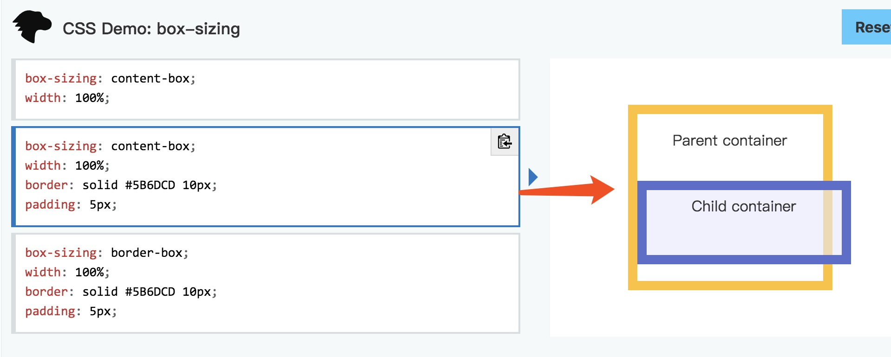
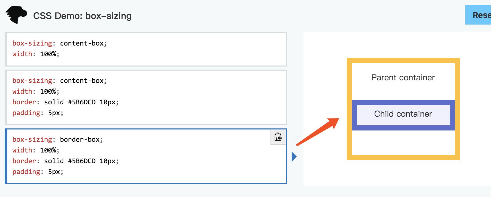

## css3中的盒布局
* display: box
>1. 盒模型：width + margin-left + margin-right + padding-left + padding-right + 2*border-width
>2. height + margin-top + margin-bottom + padding-top + padding-bottom + 2*border-width
* box-sizing属性
>1. box-sizing: content-box || border-box
>2. content-box: 默认值

#### 样图

>3. border-box:

#### 样图

## css3中的弹性盒布局
>1. 参考“flex布局.md”