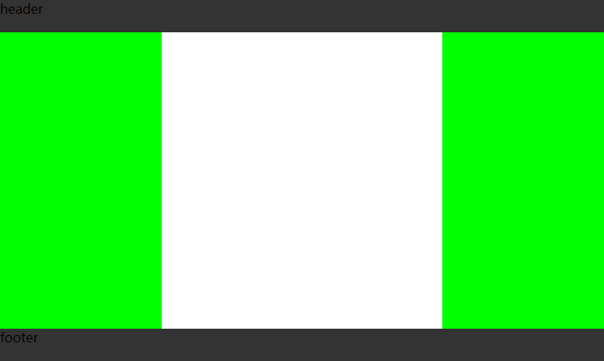

## flex布局实例

````css
* {
    margin: 0;
    padding: 0;
}
.Grid {
    display: flex;
    flex-direction: column;
    min-height: 100vh;
}
.Grid-header, .Grid-footer {
    height: 40px;
    background: #333;
}
.Grid-contain {
    display: flex;
    flex: 1;
    width: 100vw;
}
.Grid-left, .Grid-aside {
    width: 200px;
    background: #0f0;
}
.Grid-content {
    flex: 1;
}
````
````html
<div class="Grid">
    <header class="Grid-header">header</header>
    <div class="Grid-contain">
        <nav class="Grid-left"></nav>
        <main class="Grid-content"></main>
        <aside class="Grid-aside"></aside>
    </div>
    <footer class="Grid-footer">footer</footer>
</div>
````