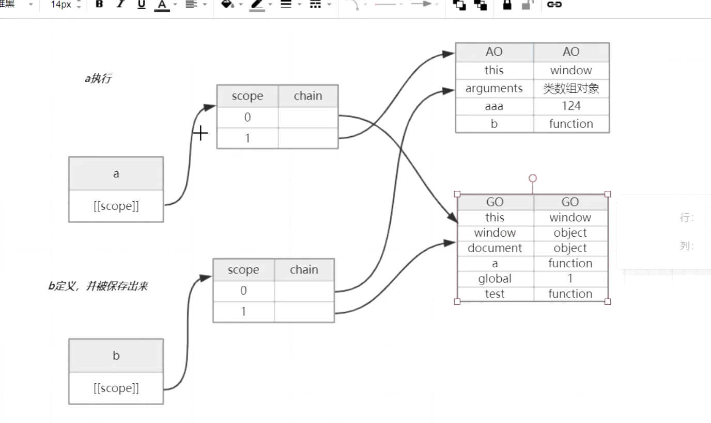

## js预编译
>1. 发生时间：发生在函数执行前一刻

### 执行上下文
>1. 当执行js代码时，会产生3种执行上下文
* 全局执行上下文
* 函数执行上下文
* eval执行上下文
>2. 每个执行上下文都有3个重要的属性
* 变量对象（全局：VO），函数是（活动对象：AO）
> 包含变量声明，函数声明，形参（arguments）
* 作用域链（变量的作用域是在定义时就决定了）
* this
>3. arguments 是函数独有的对象（箭头函数没有）
>   该对象是一个伪数组，有length属性，可以通过下标访问元素
>   该对象中的callee，代表函数自身
>   caller 代表函数的调用者

## js作用域
>1. [[Scope]]就是域，里面存储的是作用域
### js作用域链
>1. 可以理解成包含<code>自身变量对象</code>和<code>上级变量对象</code>的一个列表，通过
> [[Scope]]查找上级变量

### example1
````js
var a = 10;
function foo(i) {
    var b = 20
}
foo()
````
````js
stack = [
    globalContext,
    fooContext
]
globalContext.VO = {
    a: undefined,
    foo: <Function>
}
fooContext.AO = {
    i: undefined,
    b: undefined,
    arguments: <>
}
// fooContext作用域链
fooContext.Scope = fooContext.AO + fooContext.[[Scope]]
                 = [ fooContext.AO, globalContext.VO ]
````

### example2
````js
b() // call b
console.log(a) // undefined

var a = 'Hello world'
function b() {
    console.log('call b')
}
````
````js
stack = [
    globalContext,
    bContext
]
globalContext.VO = {
    a: undefined,
    b: <Function>
}
bContext.AO = {
    arguments: <>
}
bContext.Scope = bContext.AO + bContext.[[Scope]]
               = [bContext.AO, globalContext.VO]
````
>1. 上面是因为函数和变量提升的原因
>2. 通常的提升解释是说将声明到代码移动到了顶部。但是更准确的解释是：
>3. 在生成执行上下文时，会有两个阶段:
>4. 第一个阶段是创建的阶段（具体步骤是创建 VO），JS 解释器会找出需要提升的变量和函数，并且给他们提前在内存中开辟好空间，函数的话会将整个函数存入内存中，变量只声明并且赋值为 undefined。
>5. 在第二个阶段，也就是代码执行阶段，我们可以直接提前使用。

**函数声明优于变量声明提升，相同函数会覆盖上一个函数**
````js
b() // call b second

function b() {
	console.log('call b fist')
}
function b() {
	console.log('call b second')
}
var b = 'Hello world'
````
**let 存在暂时性死区，导致不能在声明前使用**

### example3
````js
function fn(a) {
    console.log(a); // function a() {}
    var a = 123;
    console.log(a); // 123
    function a() {}
    console.log(a); // 123
    var b = function() {}
    console.log(b); // function() {}
    function c() {}
    console.log(c); // function c() {}
}
fn(1)
````
### example4
````js
console.log(test) // function test() {}
console.log(b) // undefined
function test(a) {
    console.log(c) // undefined
    var a = b = 345
    c = 9
    if(false) {
        var c = 789
    }
    console.log(a) // 345
    console.log(c) // 9
}
test(234)
console.log(b) // 345
console.log(test) // function test() {}
var test = 123
var b = 456
````

## js中闭包
>1. 有权访问另一个函数作用域中变量的函数，就称为闭包
>2. 以下情况就会产生闭包，函数b就称为闭包
````js
function a() {
    // 函数b定义时，是站在函数A肩膀上看世界的
    function b() {
        // 函数执行时，才会到这里
        var bbb = 234;
        console.log(aaa)
    }
    var aaa = 123
    return b
}
var test = a()
test()

// 立即执行的函数，会产生闭包
(function(){
    console.log(1)
})()
````

### example5
````js
function a() {
    // 函数b定义时，是站在函数A肩膀上看世界的
    function b() {
        // 函数执行时，才会到这里
        var b = 234;
        a = 0;
    }
    var a = 123;
    b()
    console.log(a) // 0
    console.log(b) // function b() {}
}
a()
console.log(a)

stack = [
    globalContext.VO,
    aContext.AO
]
globalContext.VO = {
    a: <Function>
}
aContext.AO = {
    a: undefined 123 0 // 这里的a 和 全局的a 不一样， 因为是使用var重新声明的
    b: <Function>,
}
bContext.AO = {
    b: undefined 234 // 这里的b 和 aContext.AO里的b 不一样， 因为是使用var重新声明的
}
// 对于闭包B
bContext.Scope = [
    bContext.AO,
    AContext.AO,
    globalContext.VO
]
````
